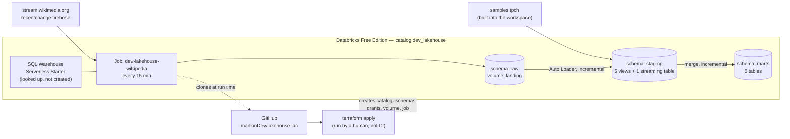
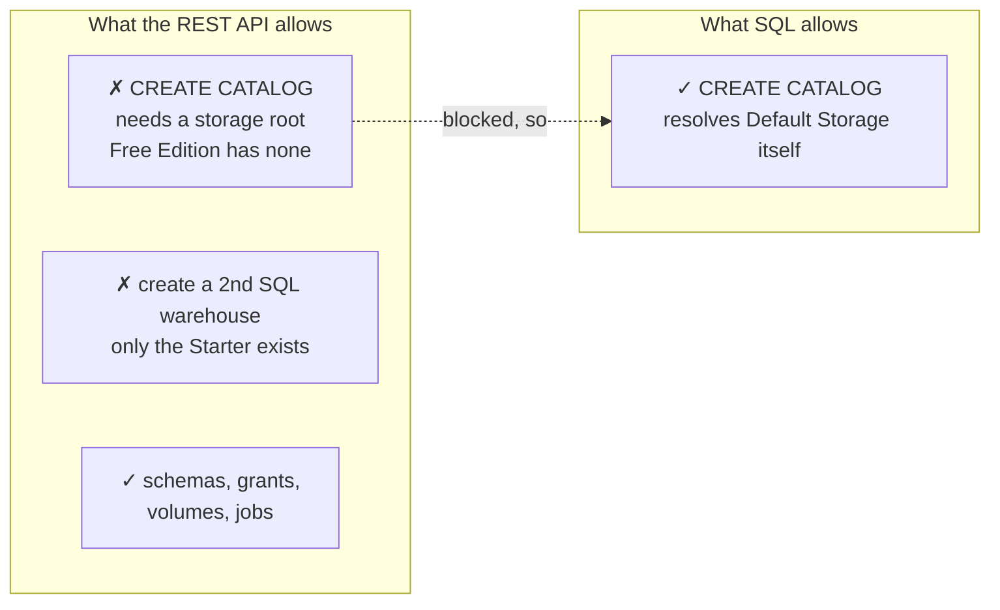
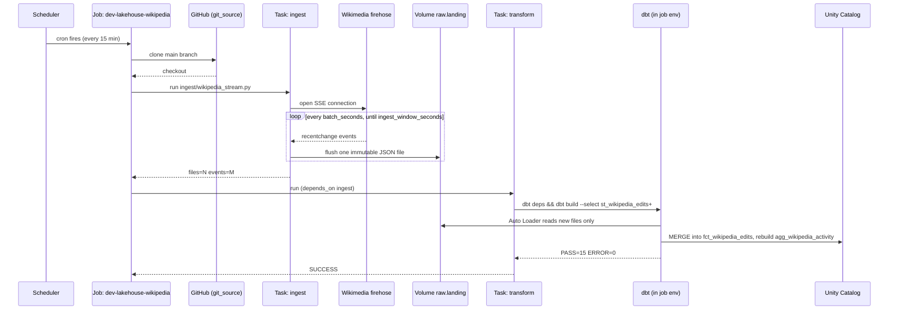

# ARCHITECTURE — lakehouse-iac

A map of what exists, what created it, and why. [SPEC.md](SPEC.md) explains the
reasoning behind each decision; [USAGE.md](USAGE.md) explains how to operate
the project folder by folder. This file is the picture that ties both together.

---

## 1. System overview

This is deliberately the *static* picture — what exists and what contains
what. The *dynamic* picture, what happens when the job actually runs, is §6's
sequence diagram; splitting the two keeps either one readable.

Two data paths share one platform:

| | Batch | Streaming |
|---|---|---|
| Source | `samples.tpch` (already in the workspace) | Wikimedia EventStreams (public internet) |
| Entry point | dbt reads it directly | A Python task lands it as files first |
| Trigger | Manual (`dbt build`) | Job schedule, every 15 minutes |
| Landing | — (queried in place) | Volume `dev_lakehouse.raw.landing` |

---

## 2. Who owns what

This is the one rule the whole project is built around:

> **Terraform owns the containers. dbt owns what is inside them. Databricks
> creates some things implicitly, on its own, that neither tool ever declares.**

| Object | Created by | How |
|---|---|---|
| Catalog `dev_lakehouse` | Terraform | `terraform_data.catalog` → shells out to `scripts/uc-catalog.sh` (SQL, not REST — see §5) |
| Schemas `raw`, `staging`, `marts` | Terraform | `databricks_schema` resource |
| Grants | Terraform | `databricks_grants` resource |
| Volume `raw.landing` | Terraform | `databricks_volume` resource |
| Job `dev-lakehouse-wikipedia` | Terraform | `databricks_job` resource, in [infra/streaming.tf](infra/streaming.tf) |
| Views, streaming table, mart tables | dbt | `dbt build`, run either locally or by the job's `transform` task |
| The Lakeflow pipeline behind the streaming table | **Databricks, implicitly** | Created the moment `CREATE STREAMING TABLE ... read_files(...)` executes. Neither Terraform nor dbt ever names it. |
| Directories inside the volume | **The ingestion script** | `os.makedirs()` — the volume resource creates the volume, not its subfolders |

That fourth row is worth pausing on, since it answers a question worth asking
explicitly: **a streaming table is not just a table.** Running its `CREATE`
statement makes Databricks spin up a background Lakeflow pipeline that owns
the actual Auto Loader checkpoint and keeps the table refreshed. dbt issues
the SQL; Databricks manages the pipeline underneath it for the table's
lifetime. It appears in the Databricks UI as a pipeline, and it exists whether
or not anyone ever runs `databricks pipelines list-pipelines`.

---

## 3. Terraform, dbt, CLI, MCP — which tool did which job

This project had four different Databricks touchpoints during development,
and they are not interchangeable:

| Tool | What it actually did here | Persists? |
|---|---|---|
| **Terraform** | Defines every resource in §2's "Terraform" rows. This is the only tool whose output is durable — delete `infra/*.tf` and re-apply, and the platform is rebuilt from nothing. | Yes — this is the source of truth. |
| **dbt** | Defines every model and test under `transform/models/`. Runs either from a laptop or from the job's `transform` task. | Yes — model definitions live in the repo; the tables themselves are dbt's output. |
| **Databricks CLI** (`databricks ...`) | Used throughout development to probe what Free Edition actually allows, trigger job runs by hand, read run logs, and clean up test artifacts. Every diagnostic command in this project's history — "does creating a catalog work over the REST API", "did the job actually run" — went through the CLI. | No — a CLI command is one API call. Nothing about the platform depends on the CLI having been run; it is an operator's tool, not infrastructure. |
| **Databricks MCP server** (`tools/ai-dev-kit/`) | Installed and wired into this session for exactly this kind of exploratory work. **It was not actually invoked** — every Databricks interaction in this project went through the CLI directly instead, because the CLI was already the project's own pinned tool ([scripts/install-tools.sh](scripts/install-tools.sh)) and needed no separate wiring. | No — same as the CLI: an interface, not a resource. |

Plainly: **the job and the pipeline are Terraform resources.** The CLI and the
MCP server are ways of *looking at* and *poking* a Databricks workspace; they
were used here to figure out what Free Edition permits before writing the
Terraform that encodes it. Neither one is a deployment mechanism for this
project, and nothing in `infra/` depends on either having run.

---

## 4. Should this move to Databricks Asset Bundles (DABs)?

Short answer: **not for this project.** Reasoning below, because the
alternative is worth understanding rather than dismissing.

**What a DAB actually is.** A Databricks Asset Bundle is a `databricks.yml`
that declares jobs, Lakeflow pipelines, and a few other Databricks-native
resources, deployed with `databricks bundle deploy`. Under the hood, a bundle
deploy compiles to Terraform and runs the same `databricks` Terraform provider
this project already uses directly. A DAB is not a different engine — it is a
narrower, YAML-flavoured interface onto the same provider.

**What a DAB does not do.** It has no real model for Unity Catalog governance
— no clean way to declare a catalog, its schemas, and its grants the way
`databricks_catalog` / `databricks_schema` / `databricks_grants` do. Catalog
governance in this project is more than half of what Terraform is doing.
Moving the job into a bundle would not let Terraform's job code disappear
project-wide — it would mean **two IaC tools with overlapping scope**, one
governing the catalog and one governing the job that reads from it, each with
its own state, needing to agree on names and IDs that the other cannot see.

**What a DAB would buy.** A tighter edit-deploy loop for the job/pipeline
definitions specifically (`databricks bundle deploy` is faster to iterate than
`terraform apply` for that slice), first-class `targets:` for dev/staging/prod
job variants, and a workflow that looks more like what a Databricks-only shop
uses day to day.

**The actual trade-off for this project.** This repository's thesis, stated
plainly in [SPEC.md](SPEC.md) §1, is that one line — Terraform owns containers,
dbt owns content — should never blur. Adding a bundle would draw a *third*
region on that map, for a resource (the job) Terraform already handles
correctly, at the cost of a second state file that can drift from the first.
For a platform-engineering portfolio piece, one coherent IaC story told well
in a general-purpose tool is a stronger signal than two tools each doing part
of the same job. If this were a Databricks-only team standardising on bundles
for everything Databricks-native, the calculus would flip — but that is not
what this repository is arguing.

**Where it would make sense here, if anywhere.** If the job/pipeline surface
grows a lot — many jobs, many Lakeflow pipelines, frequent iteration on task
graphs — splitting *just that layer* into a bundle while Terraform keeps
governance is a defensible seam. Not needed at the current size: one job, two
tasks.

---

## 5. Free Edition — where the platform pushed back

Two decisions in `infra/` exist only because of constraints measured against
the live workspace, not assumed from documentation:

| Constraint | What broke | The fix |
|---|---|---|
| No storage account attached | `databricks_catalog` fails: `Metastore storage root URL does not exist` | `terraform_data.catalog` shells out to a `CREATE CATALOG` SQL statement instead ([scripts/uc-catalog.sh](scripts/uc-catalog.sh)), with a destroy provisioner so `terraform destroy` still cleans up |
| Exactly one SQL warehouse, uncreatable | A `databricks_sql_warehouse` resource would fail | `data.databricks_sql_warehouse` — a lookup, not a resource |

Both are documented in code comments at the point they matter, not only here.

---

## 6. What happens on one job run

Two tasks, not one, because they fail differently: `ingest` holds a network
connection open and writes files; `transform` is a batch SQL run against a
warehouse. Splitting them means a dbt failure never loses events already
landed — they simply wait in the volume for the next successful `transform`.

---

## 7. Decisions worth recording

Short-form ADRs — the choice, and the alternative it beat.

| Decision | Chosen | Rejected because |
|---|---|---|
| Catalog creation | SQL statement via `local-exec` | The native `databricks_catalog` resource — fails outright on Free Edition |
| Warehouse | `data` source (lookup) | `resource` (create) — Free Edition allows exactly one, already provisioned |
| Ingestion vs. transform | Two job tasks | One task doing both — a dbt failure would strand the ingested events with no boundary |
| Wikipedia event key | `meta.id` (UUID) | Surrogate key over `(wiki, recent_change_id)` — collided, because `recent_change_id` is null on most `log` events and the surrogate hash maps every null to the same value |
| Job environments | Two (`ingest`, `dbt`) | One shared environment — would force the ingestion task to wait on dbt's dependency install before opening the stream connection |
| dbt task catalog | Declared explicitly on `dbt_task` | Relying on `profiles.yml` — a `dbt_task` generates its own profile at run time and ignores the repository's, defaulting to the legacy Hive metastore |
| Schedule interval | 15 minutes | 5 minutes — shorter than a full run, so triggers were silently dropped with `MAX_CONCURRENT_RUNS_EXCEEDED` instead of queued |
| Job/pipeline IaC | Terraform, alongside catalog governance | A Databricks Asset Bundle — would split one platform across two state files for no capability this project needs (see §4) |
| Real-time mode | `streaming_mode` variable, default `triggered` | Continuous by default — holds compute 24/7, which is expensive against an unmetered Free Edition allowance for a default nobody asked to run permanently |

---

## 8. What "dbt docs" would add

Not built yet, so worth explaining what it is rather than leaving it as a bare
line item.

`dbt docs generate` reads the compiled project — every model, every test,
every `ref()` and `source()` — and writes a static website: one page per
model showing its compiled SQL, its columns and descriptions, its tests, and
crucially a **lineage graph**: an interactive diagram of every model's
upstream and downstream dependencies, clickable, for the whole project at
once. `dbt docs serve` runs it locally; the same output directory can be
published anywhere static files can be hosted — GitHub Pages, an S3 bucket, a
Databricks app — since it is plain HTML/CSS/JS with no server-side component.

For this project it would render, automatically and always in sync with the
code, the exact picture §1's hand-drawn diagram approximates by hand — plus
every column-level description already written in the `_*.yml` files.

---

## 9. Current inventory

Everything below exists in the live workspace as of the last verified run.

| | |
|---|---|
| Catalog | `dev_lakehouse` |
| Schemas | `raw`, `staging`, `marts` |
| Volume | `dev_lakehouse.raw.landing` |
| Warehouse (looked up, not owned) | `Serverless Starter Warehouse` |
| Job | `dev-lakehouse-wikipedia`, schedule `0 0/15 * * * ?` |
| Batch models | 5 staging views, `dim_customers`, `fct_orders`, `agg_sales_by_month` |
| Streaming models | `st_wikipedia_edits` (streaming table), `fct_wikipedia_edits`, `agg_wikipedia_activity` |
| Last verified end-to-end run | `ingest`: 5 files / 1,981 events · `transform`: PASS=15 ERROR=0 |
| Measured minimum latency | 144 seconds, edit to queryable row |

See [SPEC.md](SPEC.md) §9 for the full breakdown with row counts.
