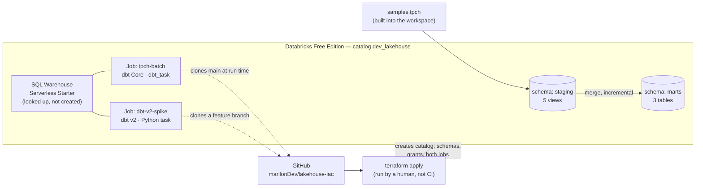
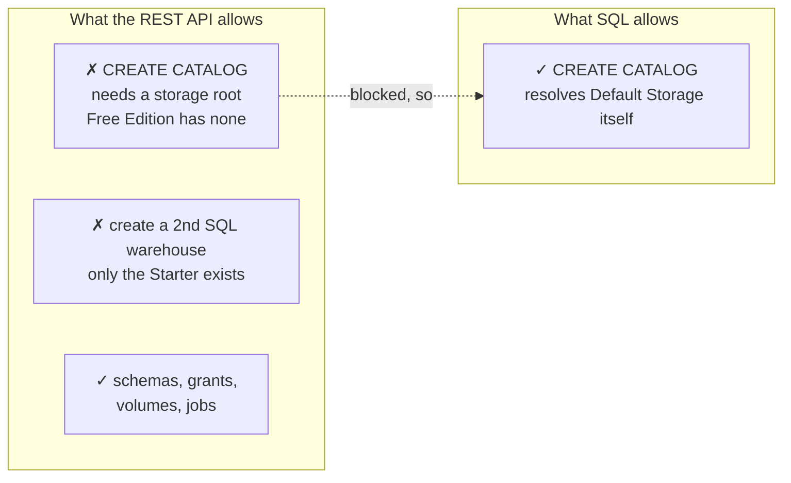
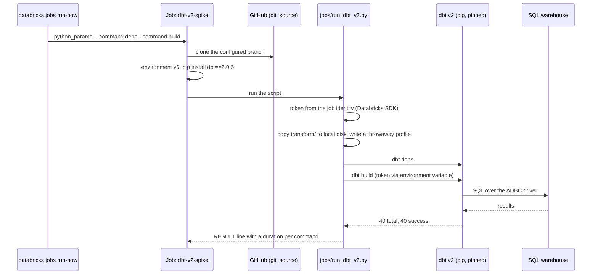

# ARCHITECTURE — lakehouse-iac

A map of what exists, what created it, and why. [SPEC.md](SPEC.md) explains the
reasoning behind each decision; [USAGE.md](USAGE.md) explains how to operate
the project folder by folder. This file is the picture that ties both together.

---

## 1. System overview

This is deliberately the *static* picture — what exists and what contains
what. The *dynamic* picture, what happens when the dbt v2 job runs, is §6's
sequence diagram.

Both jobs build the same 40 nodes from the same project, and neither depends on
the other. They differ in one thing: the dbt engine.

---

## 2. Who owns what

This is the one rule the whole project is built around:

> **Terraform owns the containers and the jobs. dbt owns what is inside the
> containers.**

| Object | Created by | How |
|---|---|---|
| Catalog `dev_lakehouse` | Terraform | `terraform_data.catalog` → shells out to `scripts/uc-catalog.sh` (SQL, not REST — see §5) |
| Schemas `staging`, `marts` | Terraform | `databricks_schema` resource |
| Grants | Terraform | `databricks_grants` resource |
| Jobs `dev-lakehouse-tpch-batch` and `dev-lakehouse-dbt-v2-spike` | Terraform | Two `databricks_job` resources, in [infra/batch.tf](infra/batch.tf) and [infra/dbt_v2.tf](infra/dbt_v2.tf) |
| Views and mart tables | dbt | `dbt build`, run by either job |
| The token dbt v2 authenticates with | **The job's identity** | Fetched at run time through the Databricks SDK; never stored anywhere |

---

## 3. Terraform, dbt, CLI, MCP — which tool did which job

This project had four different Databricks touchpoints during development,
and they are not interchangeable:

| Tool | What it actually did here | Persists? |
|---|---|---|
| **Terraform** | Defines every resource in §2's "Terraform" rows. This is the only tool whose output is durable — delete `infra/*.tf` and re-apply, and the platform is rebuilt from nothing. | Yes — this is the source of truth. |
| **dbt** | Defines every model and test under `transform/models/`. Runs either from a laptop or from the job's `transform` task. | Yes — model definitions live in the repo; the tables themselves are dbt's output. |
| **Databricks CLI** (`databricks ...`) | Used throughout development to probe what Free Edition actually allows, trigger job runs by hand, read run logs, and clean up test artifacts. Every diagnostic command in this project's history — "does creating a catalog work over the REST API", "did the job actually run" — went through the CLI. | No — a CLI command is one API call. Nothing about the platform depends on the CLI having been run; it is an operator's tool, not infrastructure. |
| **Databricks MCP server** | Set up once for exactly this kind of exploratory work, never invoked — every Databricks interaction in this project went through the CLI directly, because the CLI was already the project's own pinned tool ([scripts/install-tools.sh](scripts/install-tools.sh)) and needed no separate wiring. Removed from the repository since. | No — same as the CLI: an interface, not a resource. |

Plainly: **the jobs are Terraform resources.** The CLI and the
MCP server are ways of *looking at* and *poking* a Databricks workspace; they
were used here to figure out what Free Edition permits before writing the
Terraform that encodes it. Neither one is a deployment mechanism for this
project, and nothing in `infra/` depends on either having run.

---

## 4. Should this move to Databricks Asset Bundles (DABs)?

Short answer: **not for this project.** Reasoning below, because the
alternative is worth understanding rather than dismissing.

**What a DAB actually is.** A Databricks Asset Bundle is a `databricks.yml`
that declares jobs, Lakeflow pipelines, and a few other Databricks-native
resources, deployed with `databricks bundle deploy`. Under the hood, a bundle
deploy compiles to Terraform and runs the same `databricks` Terraform provider
this project already uses directly. A DAB is not a different engine — it is a
narrower, YAML-flavoured interface onto the same provider.

**What a DAB does not do.** It has no real model for Unity Catalog governance
— no clean way to declare a catalog, its schemas, and its grants the way
`databricks_catalog` / `databricks_schema` / `databricks_grants` do. Catalog
governance in this project is more than half of what Terraform is doing.
Moving the job into a bundle would not let Terraform's job code disappear
project-wide — it would mean **two IaC tools with overlapping scope**, one
governing the catalog and one governing the job that reads from it, each with
its own state, needing to agree on names and IDs that the other cannot see.

**What a DAB would buy.** A tighter edit-deploy loop for the job/pipeline
definitions specifically (`databricks bundle deploy` is faster to iterate than
`terraform apply` for that slice), first-class `targets:` for dev/staging/prod
job variants, and a workflow that looks more like what a Databricks-only shop
uses day to day.

**The actual trade-off for this project.** This repository's thesis, stated
plainly in [SPEC.md](SPEC.md) §1, is that one line — Terraform owns containers,
dbt owns content — should never blur. Adding a bundle would draw a *third*
region on that map, for a resource (the job) Terraform already handles
correctly, at the cost of a second state file that can drift from the first.
For a platform-engineering portfolio piece, one coherent IaC story told well
in a general-purpose tool is a stronger signal than two tools each doing part
of the same job. If this were a Databricks-only team standardising on bundles
for everything Databricks-native, the calculus would flip — but that is not
what this repository is arguing.

**Where it would make sense here, if anywhere.** If the job/pipeline surface
grows a lot — many jobs, many Lakeflow pipelines, frequent iteration on task
graphs — splitting *just that layer* into a bundle while Terraform keeps
governance is a defensible seam. Not needed at the current size: one job, two
tasks.

---

## 5. Free Edition — where the platform pushed back

Two decisions in `infra/` exist only because of constraints measured against
the live workspace, not assumed from documentation:

| Constraint | What broke | The fix |
|---|---|---|
| No storage account attached | `databricks_catalog` fails: `Metastore storage root URL does not exist` | `terraform_data.catalog` shells out to a `CREATE CATALOG` SQL statement instead ([scripts/uc-catalog.sh](scripts/uc-catalog.sh)), with a destroy provisioner so `terraform destroy` still cleans up |
| Exactly one SQL warehouse, uncreatable | A `databricks_sql_warehouse` resource would fail | `data.databricks_sql_warehouse` — a lookup, not a resource |

Both are documented in code comments at the point they matter, not only here.

---

## 6. What happens when the dbt v2 job runs

`dbt_task` supports only dbt Core, so this job uses a Python task of its own.

The Core job is the same shape without the runner: `dbt_task` generates its own
profile and runs the commands.

---

## 7. Decisions worth recording

Short-form ADRs — the choice, and the alternative it beat.

| Decision | Chosen | Rejected because |
|---|---|---|
| Catalog creation | SQL statement via `local-exec` | The native `databricks_catalog` resource — fails outright on Free Edition |
| Warehouse | `data` source (lookup) | `resource` (create) — Free Edition allows exactly one, already provisioned |
| dbt task catalog | Declared explicitly on `dbt_task` | Relying on `profiles.yml` — a `dbt_task` generates its own profile at run time and ignores the repository's, defaulting to the legacy Hive metastore |
| Job IaC | Terraform, alongside catalog governance | A Databricks Asset Bundle — would split one platform across two state files for no capability this project needs (see §4) |
| Where dbt runs | Databricks jobs | A developer machine. Nothing in the workflow depends on a local dbt; the local machine edits code, runs Terraform, and calls the CLI |
| How dbt v2 runs | A Python task running `jobs/run_dbt_v2.py` | `dbt_task` — documented for dbt Core with `dbt-databricks` only, its examples pin `<2.0.0` |
| dbt v2 authentication | `auth_type: token`, token from the job's identity via the SDK | OAuth U2M: the v2 adapter has no Databricks-CLI flow, only external-browser OAuth, and a token-expiry bug (dbt-labs/dbt#14317) is closed but was marked `needs-repro`. A personal access token would work but needs a secret |
| Runner working directory | A scratch copy of `transform/` on local disk | Running from the Git checkout — under `/Workspace/Repos/.internal` a native process cannot create directories (`os error 22`), and dbt v2 needs `logs/`, `target/` and `dbt_packages/` |
| dbt v2 pinning | Exact version in Terraform | A range — the package is a sdist that fetches binaries when pip builds it, so `uv.lock` cannot make two installs identical, and a range would let two runs of one commit execute different builds |
| Spike environment | Serverless environment version 6, spike job only | Moving everything: the Core job is the baseline, so it must not change while it is being measured against |
| Streaming | Removed | Kept alongside batch. The project moved to batch ingestion; the streaming design and what it taught stay in the git history |

---

## 8. Current inventory

Everything below exists in the live workspace, on the branch
`feat/dbt-v2-sail-spike`.

| | |
|---|---|
| Catalog | `dev_lakehouse` |
| Schemas | `staging`, `marts` |
| Warehouse (looked up, not owned) | `Serverless Starter Warehouse` |
| Core job | `dev-lakehouse-tpch-batch`, no trigger, environment version 3 |
| dbt v2 job | `dev-lakehouse-dbt-v2-spike`, no trigger, environment version 6, `dbt==2.0.6` |
| Models | 5 staging views, `dim_customers`, `fct_orders`, `agg_sales_by_month` |
| Nodes | 40, with their tests |
| Parity, dbt v2 against dbt Core | 11 of 11 comparisons identical: row counts and whole-row checksums |
| Not yet proven | `fct_orders` rebuilt from scratch under dbt v2; any speed claim |

See [SPEC.md](SPEC.md) §9 and §10 for the detail and for what comes next.
